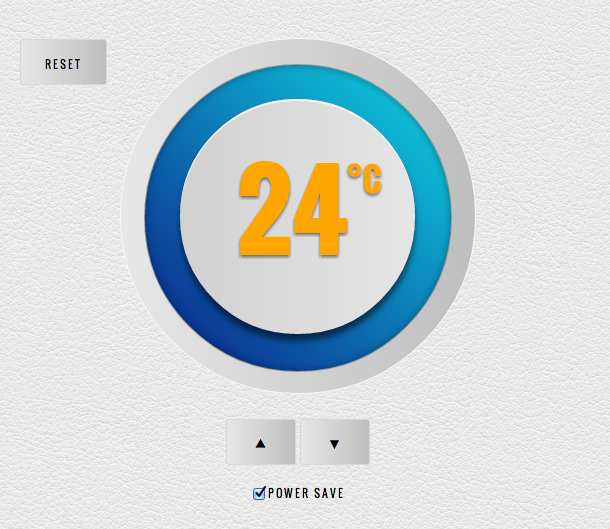

#Javascript Thermostat

###Final Version


The challenge was to create a simple interface for a digital thermostat, like so:


####Deployed
To view, visit: [http://nestthermostat.herokuapp.com](http://nestthermostat.herokuapp.com)

###Technologies

- Javascript and JQuery
- Tested in Jasmine
- Styled with HTML & CSS

###Specifications

- Thermostat starts at 20 degrees
- You can increase the temp with the up button
- You can decrease the temp with the down button
- The minimum temperature is 10 degrees
- If powersaving mode is on, the maximum temperature is 25 degrees
- If powersaving mode is off, the maximum temperature is 32 degrees
- Power saving mode is default
- You can reset the temperature to 20 by hitting the reset button
- The thermostat should color the display based on energy usage - < 18 is green, < 25 is yellow, otherwise red
- After every temperature change, the thermostat makes a POST request to localhost:4567/temperature_change, with the new temperature


###View the code

```sh
git clone https://github.com/csharpd/nest.git
cd nest
bundle install
```

###Test

Open `SpecRunner.html` in your browser
